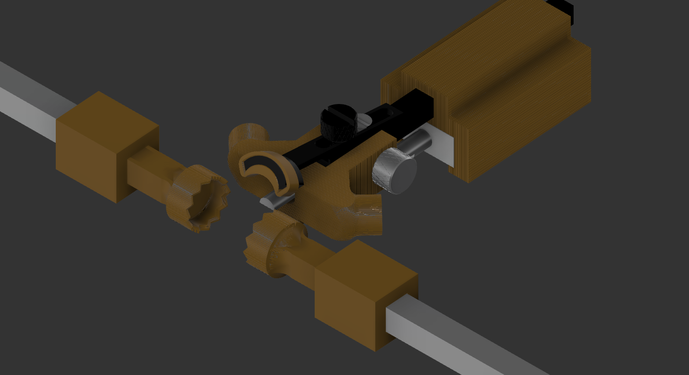

# CAD files for a stereotaxic adaptor enabling injections in infant mice.

### Overview 
- [Fusion360 STL exports](https://github.com/LoaloaF/stereotaxic-surgery-adapter/tree/main/Fusion360%20STL%20exports "Fusion360 STL exports") - Six ready-to-print STL files composing the adapter
- [Fusion360 files](https://github.com/LoaloaF/stereotaxic-surgery-adapter/tree/main/Fusion360%20files "Fusion360 files") - Original Fusion360 CAD files for customizing designs
- [SketchUp files (inital version of adapters)](https://github.com/LoaloaF/stereotaxic-surgery-adapter/tree/main/SketchUp%20files%20(inital%20version%20of%20adapters)  "SketchUp files (inital version of adapters)") - STL-, and SketchUp files of initial prototype adaptor (deprecated)

<!--  -->
<!--  -->

### Assembly illustration

## Citation
**In case of use, please consider citing this work:**
Steffens S, Bakker J, Glat M, Keimpema E, Pollak DD, Hökfelt T, Harkany T. 3D-print design of a stereotaxic adaptor for the precision targeting of brain structures in infant mice. Eur J Neurosci. 2022 Jan 2. doi: 10.1111/ejn.15588. Epub ahead of print. PMID: 34978111.
